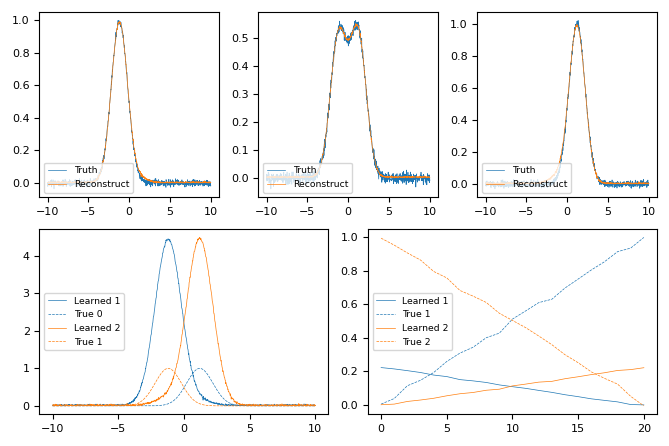
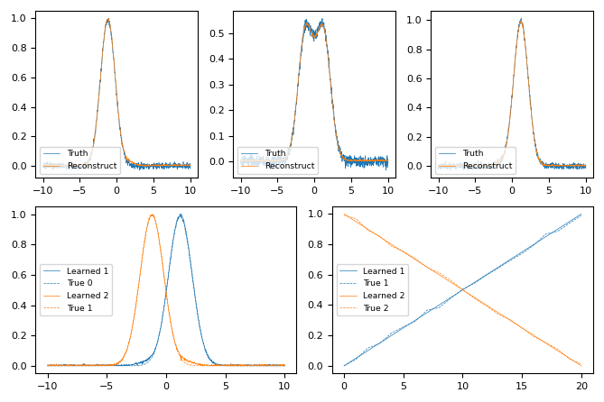
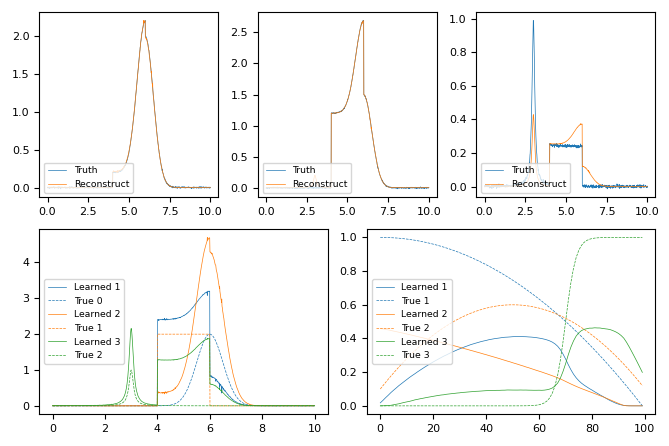
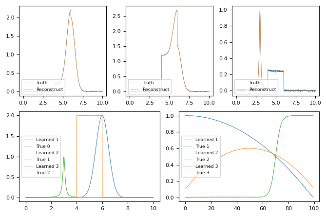
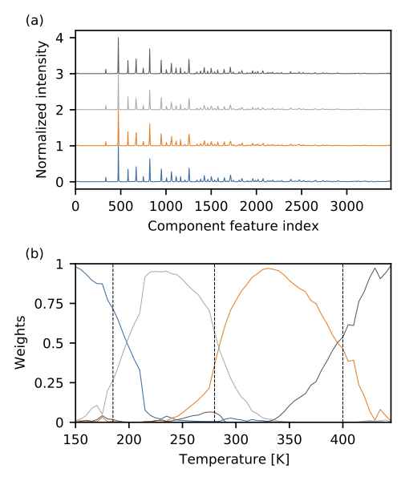

========
Examples
========

A suite of example scripts are provided in :code:`example_output` to reproduce the  results of `this paper <https://arxiv.org/abs/2104.00864>`_.
To access these examples, clone the github repository.

.. code-block:: bash

    $ source cmf_env/bin/activate
    $ git clone https://github.com/nsls-ii/constrained-matrix-factorization
    $ cd constrained-matrix-factorization/example_scripts
    $ python EXAMPLE_NAME

Fixing weights in a "toy" problem
---------------------------------
Fixing weights has been identified as a desired use case, highlighting the challenge of retaining physically relevant
components from NMF even when the weights are known *a priori*.
This is a common situation in diffraction studies of variable composition or phase mixing, where complementary
experimental information (preparation conditions or spectroscopy) may indicate the concentration of individual phases
without specifying the diffraction patterns of the phases.
We considered a continuous mixture of two Gaussian functions,
where noise is added both to the composition and to the final function.

Run the following to produce 2 figures in  :code:`example_output`::

    $ python fixing_weights.py

    Without constraining weights, the model over-fits the data, and misses the magnitude of the components.

    By constraining weights, the model adequately fits the data, and captures the magnitude of the components.

The core functionality is achieved with this code

.. code-block:: python

    ideal_weights = np.array(
        list(zip(*[(x, 1 - x) for x in np.linspace(0, 1, X.shape[0])]))
    )
    input_W = [torch.tensor(w[None, :], dtype=torch.float) for w in ideal_weights.T]
    nmf = NMF(
        X.shape,
        n_components=2,
        initial_weights=input_W,
        fix_weights=[True for _ in range(len(input_W))],
    )
    nmf.fit(torch.tensor(X), beta=2)

Fixing components in a "toy" problem
------------------------------------
Prior knowledge of the components of a material is an even more common use case.
We first show a purposefully complicated example combining an overlapping Lorentzian, Gaussian, and Box function linearly
mixed with non-monotonically varying weights.

Run the following to produce 2 figures in  :code:`example_output`::

    $ python fixing_components.py

    Without further constraints beyond non-negativity, the model cannot capture the complexity of the data.
    It fails to produce a meaningful reconstruction, useful components, nor meaningful weights.

    With prior knowledge of the components, the model adequately fits the data,
    and captures the varying magnitude of the weights.

The core functionality is achieved with this code

.. code-block:: python

    def constrained_nmf(X, components):
        input_H = [
            torch.tensor(component[None, :], dtype=torch.float) for component in components
        ]
        nmf = NMF(
            X.shape,
            n_components=3,
            initial_components=input_H,
            fix_components=[True for _ in range(len(input_H))],
        )
        nmf.fit(torch.tensor(X), beta=2)
        return nmf

Fixing components in variable temperature BaTiO\ :subscript:`3` data
--------------------------------------------------------------------
A common challenge at the beamline is detecting phase transitions during an experiment across a state variable.

The following example will take a variable temperature dataset to produce 5 figures in :code:`example_output`, with the
core result shown below.::

    $ python bto.py

    By using constraints drawn from a variable temperature dataset, we assume that the pure phases (read components)
    of BaTiO$_3$ will exist as prominent members of the dataset. This assumption allows for the automatic detection of
    phase transitions in this complicated material.

This example uses some helpful utilities from :code:`cmf.nmf`:

- .. autofunction:: constrainedmf.nmf.utils.sweep_components
- .. autofunction:: constrainedmf.nmf.utils.iterative_nmf

Fixing components when you're unsure of how many components to use
------------------------------------------------------------------
When unsure of how many components to consider, it is customary to use the "elbow method" and consider an inflection
point in the curve comparing reconstruction loss vs the number of components. This can be extracted from the
:code:`constrainedmf.nmf.utils.sweep_components` function. However, because the CMF approach is lightweight, it
can be worth while to run parallel instances and allow the expert or scientific user to interpret the results.

In the following dataset, there is a discontinuous transition, and a set of well structured components that very similar.
Because NMF does not have translational invariance, a physical phenomena (thermal expansion) which causes your data to
shift will be compensated by NMF casting multiple components to describe the end members of the translation. Although this
is imperfect behavior, it is predictable behavior and shown in the degenerate components in the 3, 4, and 5 component analysis below.

The following example will take a molten salt dataset to produce many figures in :code:`example_output`, with the
summary result shown below. The set of figures show the iterative results of increasing the number of constraints for
a given number of components (3, 4, and 5)::

    $ python molten_salt.py

.. figure:: figures/molten_salts_xrd_summary.png
    :figclass: align-center

    Automated constrained NMF was run using 3-5 components asynchronously on the molten salt dataset.
    The learned components for the (a) 3, (c) 4, and (e) 5 component decompostions provide insight into thermal expansion,
    and phases present during the temperature ramp.
    The learned weights for the  (b) 3, (d) 4, and (f) 5 component decompositions demonstrate the second-order phase
    transition, the characteristic response to thermal expansion, and persistence of a solid phase after 400 K.

